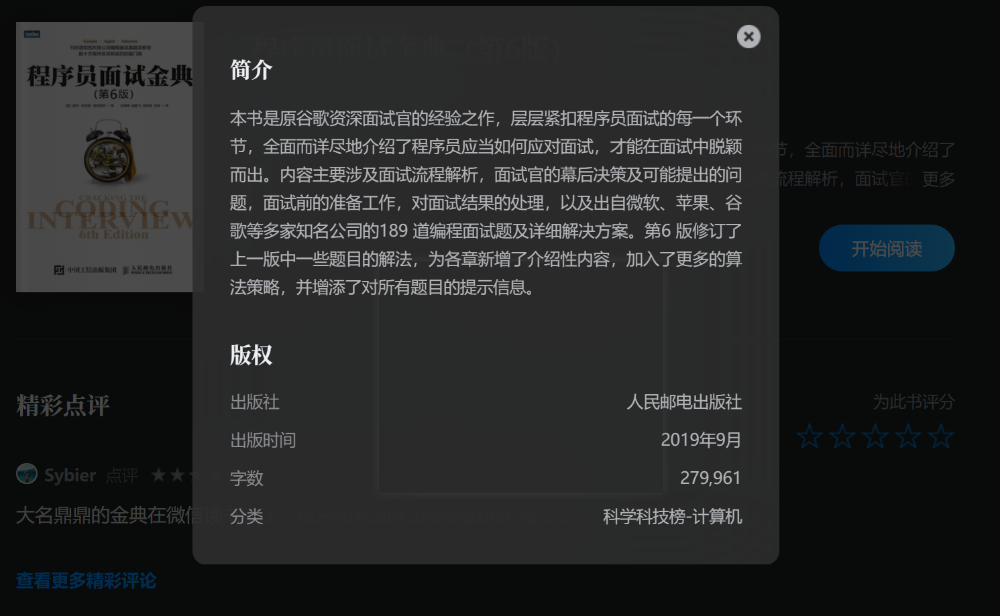

大名鼎鼎的金典在微信读书上了，程序员欢迎来到更疯狂的内卷里

版权信息书名：程序员面试金典（第6版）作者：[美]盖尔·拉克曼·卖克道尔译者：刘博楠，赵鹏飞，李琳骁，漆犇出版社：人民邮电出版社出版时间：2019-09ISBN：9787115517197本书由北京图灵文化发展公司授权上海阅文信息技术有限公司进行制作与发行版权所有·侵权必究

作者简介盖尔·拉克曼·麦克道尔(Gayle Laakmann McDowell)CareerCup创始人兼CEO，是一位知名软件工程师，曾在微软、苹果与谷歌任职。早先，她自己就是一位十分成功的求职者，通过了微软、谷歌、亚马逊、苹果、IBM、高盛等多家知名企业极其严苛的面试过程。工作以后，她又成为一位出色的面试官。在谷歌任职期间，她还是该公司有名的面试官及招聘委员会成员，其间阅人无数，积累了相当丰富的面试经验。除此书外，还著有《产品经理面试宝典》《金领简历：敲开苹果、微软、谷歌的大门》。

中文版推荐序一

拉勾还是可以的 招聘 

平均一家50人   两千多万的互联网人才   这么多  互联网人才 程序员 

拉勾招聘是中国优秀的互联网招聘平台之一。如今，有50多万互联网公司以及2000多万互联网人才在使用拉勾招聘找工作。拉勾招聘对互联网人才，尤其是程序员这个群体非常了解。人才是一家公司最重要的资产，优秀的程序员永远稀缺！面试时，公司看重的不仅仅是候选人的经验，对于其文化契合度、基础算法，以及未来潜力的考察也越来越细致和深入。对求职者来说，找到一份称心如意的工作极其不易，需要精心准备，这也是和公司缘分匹配的一个过程。

我本人也经历过找工作的艰辛，所以对此深有体会。不管是经验丰富的“老司机”“老鸟”，还是初入职场的“小白”“菜鸟”，面试准备都是必不可少的。求职者可以登录招聘网站（比如拉勾招聘）了解一家公司的发展历程、公司人数，体验其现有产品，掌握其他候选人对这家公司的面试评价，从而更加全面立体地了解面试公司。当然，求职者也会关心公司都有哪些福利，办公环境是否舒适，是否有健身房，是否有下午茶，等等。

算法和数据结构  

分析问题  和解决问题的能力 

绝大多数互联网公司面试程序员时都会考查算法和数据结构，对于每一个程序员来说，提升算法和数据结构等方面的技能至关重要。算法题目形式多样，通过这些题目，能考查求职者的基础知识是否扎实，是否有分析问题和解决问题的能力。《程序员面试金典》是一本经典求职面试书，书中涉及数量众多、质量上乘的算法和数据结构面试题，不仅有解题思路和原理的讲解，还有实例演示和不同难度题的多种解法，是程序员求职的好帮手，闲暇之余翻阅一下也会有助于日常编码能力的提升。在此，祝每一位程序员都能找到自己满意的工作，斩获心仪的Offer！——马建春，拉勾招聘CTO

中文版推荐序二

《程序员面试金典》是一本硅谷互联网公司技术面试经典图书。作者盖尔·拉克曼·麦克道尔结合自身丰富的面试经历，以及多年对互联网招聘行业形势的整理归纳，帮助许多想要加入Facebook、亚马逊、微软、苹果等互联网企业的求职者获得了心仪的工作机会。

算法和数据结构在现今技术面试环节中极为重要。通过力扣（LeetCode）相关数据我们发现，不论是国内一线互联网大厂还是创业公司，对程序员算法和数据结构的掌握程度越来越重视，甚至在技术面试中要求手写代码。面试过程中除了会出现一些常用的数据结构，比如树、栈、队列等问题，也会出现一些高级的数据结构，比如图、优先队列等问题。对于算法，从最基础的排序、搜索到动态规划，都是企业非常看重的考核点。技术栈每天在不断变化，越来越多的互联网企业看中的不再只是面试者的技术广度，掌握多门计算机语言、了解多种技术栈已经不是考核程序员最为重要的因素，更为重要的是其能适应这个行业的变化并不断成长。这背后，最为核心的要素便是计算机科学思维、算法思维以及逻辑思维能力。

对于程序员读者，当你仔细阅读后，会发现本书除了能给你带来算法和数据结构等相关知识以及互联网企业招聘模式，还能帮你掌握如何将知识转化为职业成长的技能，有效应对互联网企业人才招聘模式的转变，从而将日常解决技术问题的能力提升一个层面。如果你缺乏相关工作经验，那么本书能帮你在专业技能上查缺补漏。通过阅读，你将能够整理出一个成系统的学习方向，掌握互联网企业面试流程、考点，以及一些很难了解到的注意事项，做到提前避“坑”。

对于面试官读者，判断求职者的上手速度以及未来成长空间格外重要，但更需要考察其将思路快速转化为代码的能力。借鉴硅谷成熟的模式，适当地为白板面试做些准备，能够帮助你寻找到支撑业务长久发展并有巨大成长空间的优秀工程师。职业技能提升非一日之功，静下心来仔细阅读，你将收获巨大。Have fun coding！张云浩，力扣（LeetCode）CEO

**序**

亲爱的读者：我先做个自我介绍。我不是招聘人员，而是软件工程师。正因如此，我深知要在面试现场迅速想出精妙算法并在白板上写下完美代码的感受。之所以能感同身受，是因为我与你有过同样的经历：我参加过谷歌、微软、苹果、亚马逊以及其他诸多公司的面试。我也当过面试官，让求职者做过同样的事情。我还筛选过成千上万份简历，在其中“上下求索”，希望挑出那些或许能在面试中脱颖而出的工程师。当求职者解出或者试图解出那些具有挑战性的题目时，我评估着他们的表现。在谷歌时，就某位求职者是否达到了录用要求，我曾与招聘委员会的同事有过激烈争辩。因为我反复地经历过整个流程，所以对招聘的各个环节了如指掌。亲爱的读者，你也许要在明天、下周或明年去迎接面试挑战。我撰写本书，旨在帮助你加深对计算机科学基础知识的理解，并在此之后学会该如何运用这些基础知识，成功闯过技术面试这一关。

第6版在第5版的基础上增加了70%的内容：添补了更多的面试题，修订了部分原有题目的解法，为各章新增了介绍性内容，加入了更多的算法策略，增添了对所有题目的提示信息，等等。欢迎访问我们的网站（http://www.CrackingTheCodingInterview.com），你可以跟其他求职者互通有无，发现新天地。与此同时，我也感到无比兴奋，你一定能从本书中学到新的技能。充分的准备将会使你拥有各种技术技能和沟通技巧。不管最终结果如何，只要拼尽全力，便无怨无悔！请务必用心研读本书前面的介绍性章节，其中的要点和启示也许可以决定你的面试结果，“录用”与“拒绝”就在一线之间。此外，切记：面试非易事！根据我在谷歌多年面试的经历，我留意到有些面试官会问一些“简单”的问题，有些则会专挑难题来问。但是你知道吗？面试中碰到简单的问题，不见得就能轻松过关。完美解决问题（只有极少数求职者才能做到）不是公司录用你的关键，只有把题答得比其他求职者更出色才能让你脱颖而出。所以，碰到棘手的难题不要惊慌，或许其他人一样觉得很难。解答得不够完美是没有问题的。请努力学习，不断实践。祝你好运！盖尔·拉克曼·麦克道尔CareerCup.com创始人兼CEO

前言

招聘中的问题讨论完招聘事宜，我们又一次沮丧地走出会议室。那天，我们重新审查了10位“过关”的求职者，但是全都不堪录用。我们很纳闷，是自己太过苛刻了吗？我尤为失望，因为由我推荐的一名求职者也被拒了。他是我以前的学生，以高达3.73的GPA毕业于华盛顿大学，这可是世界上最棒的计算机专业院校之一。此外，他还完成了大量的开源项目工作。他精力充沛、富于创新、头脑敏锐、踏实能干。无论从哪方面来看，他都堪称真正的极客。但是，我不得不同意其他招聘人员的看法：他还是不够格。就算我的强力推荐可以让他侥幸过关，但他在后续的招聘环节可能还是会失利，因为他的硬伤太多了。他尽管十分聪明，但答起题来总是磕磕巴巴的。大多数成功的求职者都能轻松搞定第一道题（这一题广为人知，我们只是略作调整而已），可他却没能想出合适的算法。虽然他后来给出了一种解法，但没有提出针对其他情形进行优化的解法。最后，开始写代码时，他草草地采用了最初的思路，可这个解法漏洞百出，最终还是没能搞定。他算不上表现最差的求职者，但与我们的“录用底线”相去甚远，结果只能铩羽而归。

几个星期后，他给我打电话，询问面试结果。我很纠结，不知该怎么跟他说。他需要变得更聪明些吗？不，他其实智力超群。做个更好的程序员？不，他的编程技能和我见过的一些最出色的程序员不相上下。与许多积极上进的求职者一样，他准备得非常充分。他研读过Brian W. Kernighan和Dennis M.Ritchie合著的《C程序设计语言》，也学习过麻省理工学院出版的《算法导论》等经典著作。他可以细数很多平衡树的方法，也能用C语言写出各种花哨的程序。我不得不遗憾地告诉他：光是看这些书还远远不够。这些经典学院派著作能够教会你错综复杂的研究理论，帮助你成为出类拔萃的软件工程师，但是对程序员的面试助益不多。为什么呢？容我稍稍提醒你一下：即使从学生时代起，你的面试官其实都没怎么接触过所谓的红黑树算法。

要顺利通过面试，就得“真枪实弹”地做准备。你必须演练真正的面试题，并掌握它们的解题模式。你必须学会开发新的算法，而不是死记硬背见过的题目。本书就是我根据自己在顶尖公司积累的第一手面试经验和随后在辅导求职者面试过程中提炼而成的精华。我曾经与数百名求职者有过“交锋”，本书可以说是我面试过几百位求职者后的结晶。同时，我还从成千上万求职者与面试官提供的问题中精挑细选了一部分。这些面试题出自许多知名的高科技公司。可以说，本书囊括了189道世界上最好的程序员面试题，它们都是从数以千计的好问题中挑选出来的。

我的写作方法本书重点关注算法、编程和设计问题。为什么呢？尽管面试中也会有行为面试题，但是答案会随个人的经历而千变万化。同样，尽管许多公司也会考问细节（例如，“什么是虚函数”），但通过演练这些问题而取得的经验非常有限，更多的是涉及非常具体的知识点。本书只会述及其中一些问题，以便你了解它们“长”什么样。当然，对于那些可以拓展技术技能的问题，我会给出更详细的解释。

算法 编程  设计问题 

我的教学热情我特别热爱教学。我喜欢帮助人们理解新概念，并提供一些学习工具，从而充分激发他们的学习热情。我第一次正式的教学经历是在美国宾夕法尼亚大学就读期间，那时我才读大二，同时担任本科计算机科学课程的助教。我后来还在其他一些课程中担任过助教，并最终在宾夕法尼亚大学推出了自己的计算机科学课程。该课程专注于教授一些实际的“动手”技能。

在谷歌担任工程师时，培训和指导新的工程师是我最喜欢的工作之一。后来，我还利用“20%时间”[插图]在华盛顿大学教授两门计算机科学课程。多年之后，我仍然继续在教授计算机科学的相关课程，但是这次我的目标是帮助创业公司的工程师准备收购面试。我看到他们犯了不少错误，经历了很多困难，而我正好拥有帮助他们解决这些问题的技巧和策略。

《程序员面试金典》《产品经理面试宝典》《金领简历：敲开苹果、微软、谷歌的大门》和CareerCup都能充分体现我的教学热情。即便是现在，你也会发现我经常出现在CareerCup.com上为用户答疑解惑。请加入我们的行列吧！