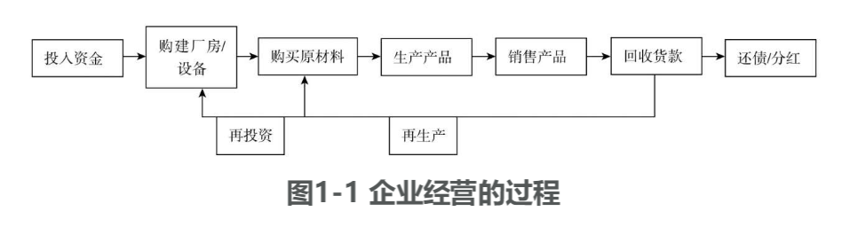
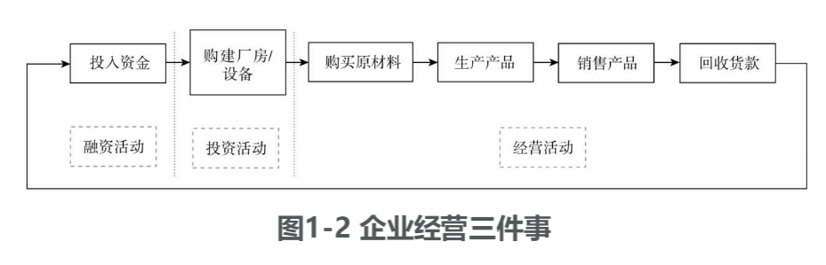
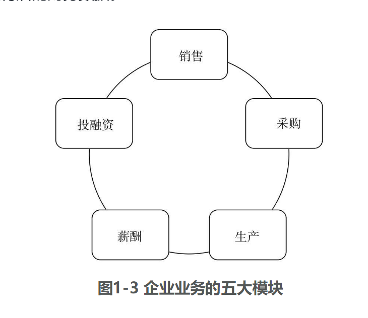

# 第1篇 了解财务知识，看清企业兴衰

# 1 “财”眼看世界 财务人眼里的企业

企业经营每天都需要做各种各样的事情，这些事情投射在财务人眼中是什么样的呢？首先我们来了解一下财务人眼中的企业。

财务人 

企业经营   财务人   管理  

一句话：金融属于经济学类，财务会计审计属于管理学类（更具体来说是工商管理类）。

金融是一种交易行为，是在做买卖，有交易对手，标的可能是资金、资产、权利、行为、预期等等。
财务是一种管理行为，任务是记录、分析、预测，它本身不参与到交易中，但可以作为交易行为的决策依据之一

管理行为   记录 分析  预测  本身不参与到交易中

但可以作为交易作为的决策依据之一 

# 1.1 企业的日常

企业中的每个员工都有自己的职责，有的负责找市场、做销售，有的为企业采购各种物资，有的生产产品、按时交货，有的负责研发、设计，有的负责投融资……除此之外，还有专门的管理人员。企业员工的这些工作在财务人眼中是什么样的呢？不同行业的企业形态各异，业务也各不相同，它们的经营动作在财务人眼中又有什么共同点呢？我们来看几个例子。

员工都有自己的职责

找市场 做销售 

为企业采购各种物资  有的生产产品

按时交贷 

研发 设计  负责

1.1.1 企业的经营流程

如果计划开一家公司，第一件事情就是注册。首先需要准备一笔钱，以及各种注册所需的材料，去相关部门注册登记，只有拿到营业执照才能生产经营。营业执照就像公司的出生证，从它签发的那一刻起，公司便宣告成立了。对于初创的公司，除了营业执照，它可能只有注册时所必需的一笔钱。不论这笔钱数量多少，也不论这家公司未来会发展成一家伟大的企业还是成立不久就快速破产，这笔钱都是公司的起点。

计划开一家公司  注册 钱  

一个新成立的企业，它所拥有的第一笔钱肯定是投资人（或称“所有者”“股东”，本书中二者混用，指代相同）投入的。不过，如果是一个持续经营的企业，它还可以从其他地方获得资金，比如向银行借款。这些投入企业的钱，自然不能在银行账上“趴”着，企业需要用这笔原始投资去赚取更多的钱。

投资人  所有者 股东  

原始投资  去 赚取更多的钱 

假如我们开一家毛绒玩具工厂，首先需要盖厂房、买设备，完善基础设施，其次需要招聘员工，然后才可以投产。开工生产需要准备生产毛绒玩具的布料、配饰、填充物，等等，我们统称它们为原材料。有了原材料，员工就可以利用设备在厂房中生产产品了。最后，我们需要把毛绒玩具卖到市场，才能实现盈利。

机器   员工   

原材料  员工利用设备 厂房中生产产品  毛绒玩具  卖到市场  实现盈利  

困难的是，做外贸玩具的人很多，卖掉这些产品不太容易。有可能顾客会向我们赊账，比如先拿走一批货，过几个星期再来付钱。这样，当我们卖掉毛绒玩具的时候，得到的不是钱，而是一个收款的权利，几个星期之后才能把这个收款的权利变成钱。

卖掉产品不太容易   

顾客赊账  先拿走一批货   再付钱  

拿到钱之后，我们可能用它去还银行贷款，可能给公司投资人分红（或称“股东分红”），也可能把这些钱留在企业，继续购买原材料，生产下一批毛绒玩具，或者购买设备、扩大生产，做更多的毛绒玩具。

1.1.2 制造业是一切企业的蓝本

以上例子是个典型的制造业企业。虽然每个企业制造的产品不尽相似，但它们经营的过程大致相同。有人会说：“制造业太辛苦，我想选择其他的行业。”事实上，很多我们认为不属于制造业的行业，都与制造业有着非常相似的特征，只不过它们“制造”的是一种特殊的产品。比如开饭店，我们当然不会认为饭店是制造业，但转念一想，饭店其实是在制造一种特殊的产品——饭菜。开饭店首先需要一笔固定的投入资金，需要买房或者租房作为开店的场所，需要购买厨房设备、各种食材，然后聘请厨师把这些食材加工成饭菜，最后把饭菜卖给顾客。这个经营过程是不是和上面的制造业非常相似？再比如建筑公司盖楼房，也是购买各种建筑材料，然后用特定的设备将建筑材料盖成房屋，再把房屋卖给房地产公司或者业主。这也可以看作“生产产品”的过程，只不过这里的产品是房子罢了。还有人说“我是做软件的”或者“做游戏的”，这也可以看作特殊的制造业。它需要生产设备——电脑，只不过没有我们通常意义上的原材料，而是直接靠脑力劳动，通过电脑生产出产品，这个产品是一个虚拟的产品（或称电子产品）——软件或游戏。最终，企业同样需要把这款软件或者游戏卖给它的顾客。

如果是服装店，它可能不需要自己生产，而是购买成衣再卖给顾客，相当于省略了制造业中的生产环节。如果是旅行社，它的生产环节是设计一些旅游产品卖给顾客，只不过这些产品是无形的。

上面列举的这些企业，不管是餐饮、建筑、软件或是服务公司，从本质上来看，和制造业企业都非常相似。在财务人眼中，这些企业有一个共同点，那就是，所有的企业都经历着一个从投入资金到回收货款的过程，循环往复、周而复始、永不停息，直到企业关门（见图1-1）。

财务人眼中

所有的企业都经历着一个从投入资金到回收贷款的过程  

循环   

1.1.3 企业经营三件事

企业经营三件事

企业经营主要做三件事。第一件事，企业的投资人（或股东）把钱投入企业，为生产经营做准备，我们称为融资活动。第二件事，企业用这些钱购买厂房、设备等基础设施，这种事并不会每天都发生，我们称为投资活动。第三件事，企业每天都在上演，那就是购买原材料、生产产品、销售产品、回收货款……我们称为经营活动。所以，企业纷繁复杂的各种交易和经济活动，在财务人眼中只有三类，那就是经营活动、投资活动和融资活动（见图1-2）。

日常业务背后的财务实质

# 1.2 日常业务背后的财务实质

1.2.1 战略选择是对环境的应对措施

企业经营活动有各种各样的表象，比如选择哪个市场、进入哪个行业、产品定在什么价位……这些表象都是各种决策的结果。那么，我们这些决策都是如何做出的呢？这取决于我们所处的环境。决策其实是对环境的一种反应。

我们所处的环境包括我们的利益相关方。比如我们生产毛绒玩具，首先需要了解其他做毛绒玩具的人做出了哪些产品、价格如何；其次需要了解客户对我们的产品有什么评价，他们还有什么需求；最后，我们要知道生产毛绒玩具的原材料，比如布料、配饰、填充物等，它们的供应商对我们的要求，以及我们如何可以买到更低价的原材料。除此之外，我们还需要了解，钱不够从哪里获取，是否能招到满足要求的员工，交多少税，以及卖掉毛绒玩具后能不能挣钱。有的行业可能还有一些特殊的问题，比如发电企业，政府会对电价有所限制，企业是不能随意定价的。

以上所说的环境包括同行、客户、供应商、劳动力市场、融资环境、税收环境、产业政策等。同一个地区、同一个行业的企业，所面临的环境是非常相似的，但显然这些企业不会完全一样。原因就在于，每家企业都会有自己不同的应对环境的措施，我们称之为战略选择（或“战略定位”）。

企业需要考虑业务组合，是只做一个业务还是同时做多个业务，这些业务之间是什么关系。比如做毛绒玩具，既可以只做毛绒玩具，也可以同时做一些其他的产品，比如做鼠标垫或者水杯，这样就会涉足多个业务。那么，在每一个业务上如何定位自己的产品呢？是高端的还是大众的？以什么价位与对手竞争？面对的目标客户是怎样的群体？这些都是战略选择。

1.2.2 执行能力决定了战略选择的结果

显然，战略选择不是无穷无尽的，同一行业中势必会有一些企业的战略选择非常相似，我们仔细观察一下身边的企业，常常会发现不少选择相似的企业。为什么有的企业成功了，而有的企业却失败了？尽管环境一样、战略选择一样，为什么结局却如此不同？因为每个企业的战略执行能力不同。也可以理解为，做同一件事情的人，因为能力不同，产生的结果也不同。这就好像同一个班级的学生，在同一间教室上课，同样的作息时间、同样的老师、同样的教材，但不是每个学生的成绩都一样。有的学生这门课成绩好，有的学生那门课成绩好。

同样的环境、相似的战略选择，但由于战略执行的能力不一样，最后的结果也会不一样。形形色色的经济活动背后，实际上有三种重要的力量：外部环境、战略选择和战略执行。它们决定了企业为什么要进行这样的经济活动，在什么样的环境下出于何种战略选择而从事这些经济活动，以及经济活动所产生的结果。

※ ※ ※

接下来，我们将了解每项经济活动与财务数据之间有什么关系。我们将把企业的业务分成五大模块：销售、采购、生产、薪酬、投融资（见图1-3），来分别讨论这五大业务模块背后的财务数据。

小结

企业的经济活动可以抽象地总结为一个“从现金到现金”的周而复始的循环过程；在此过程中的经济活动可以归结为三大类：经营活动、投资活动和融资活动；这些经济活动的背后有三个决定性的驱动因素，分别是外部环境、战略选择和战略执行。

经营活动  投资活动 融资活动  、

外部环境  战略选择和 战略执行 

