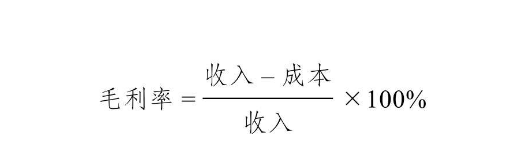
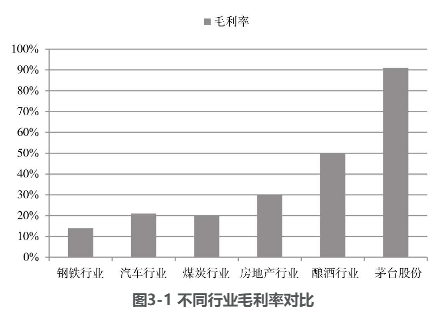
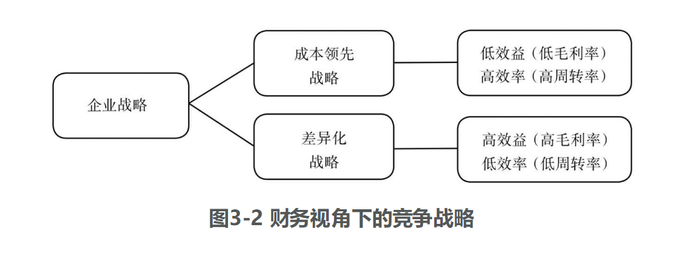
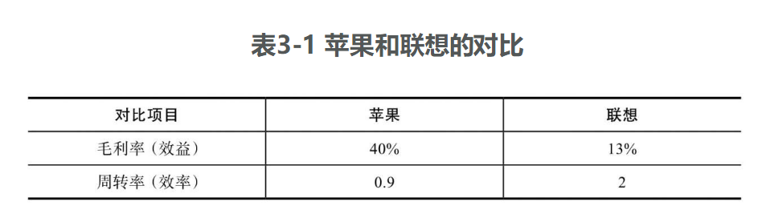
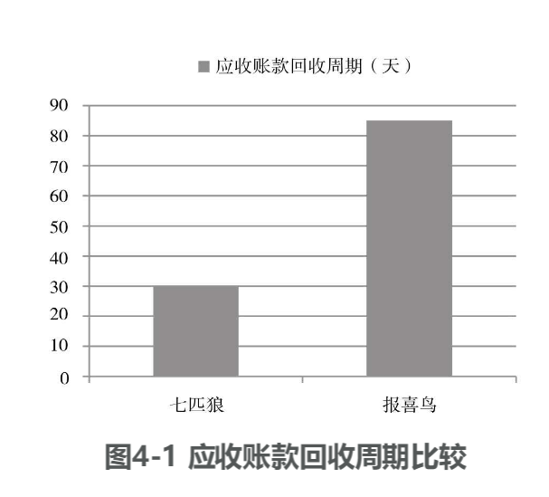
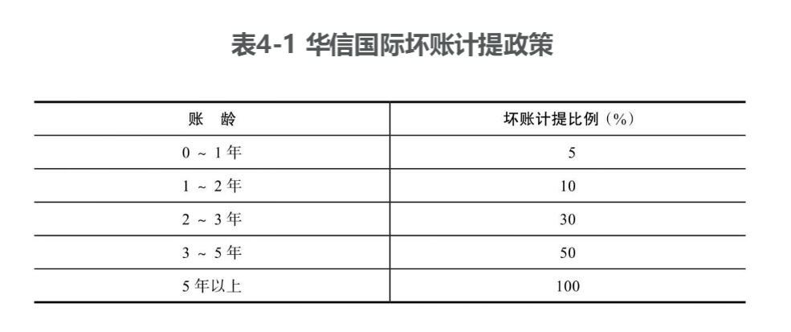

# 第2篇 认清行业大势，把脉客户关系

# 2 最爱的人伤我最深 “唯利是图”的客户

销售是企业中最重要的一项业务，只有将产品卖出去，企业才能实现收益。学习本章我们可以了解企业在销售过程中会卖什么样的产品、怎么卖、卖给谁、如何收款，以及它的竞争对手是谁。

销售是企业中最重要的一项业务  

只有将产品卖出去 企业才能实现收益

卖什么样的产品 怎么卖  卖给谁  如何收款 竞争对手是谁

唯利是图的客户  

## 2.1 卖什么

首先，我们来了解一下销售究竟卖的是什么。

观察一下身边的世界，你会发现，不同的企业销售的东西多种多样。可能是卖商品，可以是有形商品，也可以是无形商品，可以是企业自己制造的，也可以是从外面采购来的。有形商品，大到飞机、房屋、汽车，小到空调、电视、手机，甚至玩具、水杯、书包，这些商品可以由企业自己生产、自己出售，也可以由第三方，比如超市、商店出售，它们购买别人制造出的商品，再卖给需要的人。

除此之外，企业还可以销售无形商品。比如企业开发的软件，这种看不见、摸不着的东西同样是一种商品。与此相似的还有游戏、影视作品、音频产品。除了商品，企业还可以卖服务。比如，旅行社提供旅游服务，航空公司提供航空运输服务，快递公司提供递送服务，理发店提供理发服务，4S店提供汽车的维修保养服务，医院提供医疗服务，等等。

商品   产品  有形  无形  

自己生产   自己出售    第三方 

企业开发的软件  看不见 摸不着  

游戏  影视作品  音频产品   

服务  

## 2.2 卖给谁

我们通常把企业的用户分成两种类型：一种是企业，也就是我们常说的2B业务；另外一种是个人消费者，即2C业务。比如，波音公司制造的飞机，通常被卖给航空公司，即卖给另外一家企业，因此波音公司主要做2B的市场。而苹果公司生产的手机通常是卖给个人消费者，因而它做的是2C的市场。

企业  

个人消费者

各大航空公司 

## 2.3 怎么卖，如何收款

2.3.1 一手交钱，一手交货

我们这里提到的“怎么卖”是指在销售的过程中怎么收钱。作为消费者，我们最常见的购买方式是“一手交钱，一手交货”，比如，去商店购物、做美容、看病、修车、买衣服等，都是直接付款。

怎么卖  如何收款  

销售的过程中怎么收钱  

消费者  我们最常见的购买方式是  一手交钱 一手交货  

直接付款 

2.3.2 先付款，再发货

有的行业是“先付款，再发货”，比如房地产行业。房地产市场火爆时，很多房子仅有一张图纸，还没开始建，就已经销售一空。这种情况下，购房者在认购后不久就需要支付房款，这就是“先付款，再发货”的销售方式。作为个人消费者，我们也经常会遇到另一种付款方式——预付。比如，租房时，我们需要预付几个月的房租，然后才能拿到钥匙住进去。我们买水、电、气通常也是这样的方式，需要预存一笔钱，然后才能使用。现在，很多原本采用“一手交钱，一手交货”方式的企业都开始采用“先付款，再发货或再提供服务”的方式。比如，商场出售购物卡，美容院出售美容卡，健身房出售健身卡等。通过卖卡，这些企业把收款的时间提前了，消费者需要先支付相应的资金，才能够购买商品或享受服务。

先付款 再发货  

预付    租房 

预存一笔钱  才能使用 

买水 电  气  

先支付相应的资金   才能够购买商品或享受服务

2.3.3 先发货，再付款

当然，还有一种更常见的付款方式——“先发货，再付款”，这就意味着购买商品或服务的个人或企业，先拿到商品或享受服务，然后再付款。企业客户采用这种付款方式的较多，即在2B市场上，这样的收款方式更为常见。

“先发货，再付款”的收款方式又包括几种不同的形式。比如，顾客拿到了企业提供的商品或者享受了企业提供的服务，双方协商同意货款在一段时间后支付，但并没有立什么字据。除了销售合同之外，并没有再签订欠条。这种情况下，我们称这笔钱为应收账款。应收账款是相对于出售方来说的，他们把商品或者服务提供给顾客，于是获得了一项向顾客收款的权利。

先发货 再付款  

应收赊 款   she      收款的

应收账款

有时候，购买方会给出售方开具一张票据，表明它会在一段时间内支付货款，这种票据我们称为应收票据。

购买方会给出售方开具一张票据  

它又分为两种具体形式：一种是付款方的银行承诺在一定时间内付款，称为银行承兑汇票；另一种是购买方自己承诺在一定时间内付款，称为商业承兑汇票。显然，由银行承兑的票据具有更高的可信度。※ ※ ※“先发货，再付款”，即赊销/赊购的方式在现代商业社会十分常见。如大家熟悉的格力电器，它的主营业务是空调。格力有很多自营的销售门店，将商品直接卖给个人消费者，同时也有一些商品是通过其他渠道销售出去的，比如通过专门做家电销售的企业渠道，这时，它往往就需要采用“先发货，再付款”的方式来进行销售。格力电器2016年的财务报表显示，它有约30%的销售是以应收账款的结算方式进行的。乍一看，30%的比例似乎很高，我们来看另一家公司——中国建筑。中国建筑的主要业务是建房子，建筑公司需要先垫款把房子建起来，然后再收款。所以在这个行业中，应收账款是非常普遍的现象。试估一下中国建筑有多大比例的销售收入是通过应收账款来结算的。近乎百分之百！

垫款  

应收票据 

应收账款 

银行承兑汇票 

商业承兑汇票 

信用高点 

2.3.4 分期付款

除了现销、预收、赊销三种收款方式之外，还有一种常见的收款方式——分期付款。大家对这种付款方式一定不陌生，我们常常会在一些电商网站上看到“分期付款”的选项，买车时也可以选择分期付款。分期收款在面对企业客户时，也时有使用。比如中兴通讯，它和我们熟悉的华为处于同一行业，它的主要业务是通信设备制造，主要客户是电信运营商，是一个主要从事2B业务的公司。从它披露的年报中可以看出，它有相当一部分收入是采用分期收款的方式来进行的。所以，我们在进行销售活动的时候，收款方式多种多样。

分期收款     分期付款  

小结

1．卖什么？企业既可以卖商品，也可以卖服务；可以卖有形商品，也可以卖无形商品；可以卖自产商品，也可以卖外购商品。

卖商品   卖有形商品

无形商品   自产商品 外购商品 

2．把东西卖给谁？可以把企业客户分成两种类型：一种是其他企业（即2B），另一种是个人消费者（即2C）。

企业   个人消费者  

3．怎么卖、如何收款？常见的收款方式有：一手交钱，一手交货（即现销）；先付款，再发货（即预收）；先发货，再付款（即赊销，也是最常见的）；分期付款。

卖什么  企业既可以卖商品 

卖服务 

# 3 火眼金睛识对手 竞争对手

俗话说，知己知彼，百战不殆。在公司实际经营过程中，我们不仅需要了解我们自身和下游的客户，还需要了解与我们卖同样东西的竞争对手，这样才能更好地应对竞争。

实际经营过程中

不仅需要了解我们自身和下游的客户 

卖同样东西的竞争对手

应对竞争 

##   3.1 谁是竞争对手

竞争对手可以有三个来源：同行业的公司、行业新进入者和替代产品提供者。第一个来源是和我们同处一个行业的公司。比如，苹果和三星、耐克和阿迪达斯、麦当劳和肯德基，这些都是很明显的竞争关系，是属于同一行业中的公司。第二个来源是行业新进入者。所谓新进入者，就是指那些原来并不在这个行业，但是因为看到行业非常赚钱，于是也加入进来的公司。比如，京东在2011年宣布进入家电零售领域，于是国美和苏宁就面临了一个新的竞争对手，这个竞争对手原来并不在它们的行业里，属于新进入者。

同行业的公司   行业新进入者 替代产品提供者 

第三个来源是替代产品提供者。替代产品是指某种产品原来与这个行业没有任何关系，但随着技术进步，可能会把行业彻底给颠覆掉。比如，柯达虽然发明了世界上第一台数码相机，而且早在1998年就开始感觉到胶卷业务的下滑，可是由于胶卷业务的利润十分丰厚，一直舍不得放弃，没有大力发展数码相机的业务。2000年之后，数码相机的市场需求开始呈现翻倍的增长，而胶卷相机却以每年10%的速度下滑，这使得柯达在1997～2011年的15年间，市值蒸发了整整99%，最终在2012年申请了破产。这是一个典型的被替代产品颠覆的例子。形象地说，替代产品的提供者就是那个来颠覆你的“门口的野蛮人。”

搞你

行业新进入者  替代产品提供者  同行业的公司 

## 3.2 竞争的影响

3.2.1 对价格的冲击

比如，你在某个地方卖东西，旁边突然来了一个跟你卖一样东西的人，你的第一反应可能是降价。的确，竞争给你带来的第一个冲击可能就是价格，而你的成本并不会因为有别人跟你卖一样的东西而下降。所以，当价格下降而成本不降时，马上就会引发毛利率的下降。

收入减少了  成本不变  

售价  

当我们的售价下降而成本不变时，收入与成本的差就会变小，这个收入与成本的差占收入的比重自然也就下降了。

3.2.2 毛利率可以反映竞争的激烈程度

毛利率  竞争的激烈程序 

我们怎样可以了解一个行业的竞争激烈程度呢？最简单可行的方法就是花钱买行业研究报告，但这也是成本比较高的方法。另一种方法就是去询问这个行业的从业者。但十有八九你得到的答案都是“我们这个行业竞争非常激烈”，因为每个人都是以自己的标准来衡量竞争是否激烈，因此这种回答往往并不十分客观。

其实，最快捷有效的方法就是去找这个行业里公司的毛利率水平。几乎每个行业都有上市公司，它们的信息都是公开可得的，我们可以通过查阅它们公布的财务信息快捷地找到毛利率指标。

下面我们就通过毛利率直观地感受一下不同行业竞争激烈程度的差异。比如，钢铁行业这两年十分不景气，竞争激烈。2016年，钢铁行业上市公司的平均毛利率仅为14%，也就是说，售价100元的产品，成本要达到86元，中间的价差只有14元。汽车行业比钢铁行业状况好一点，但竞争也很激烈，你稍微留心一下就会发现身边到处都是汽车的广告。汽车行业上市公司在2016年的平均毛利率是21%，只比钢铁行业强一点点。类似的还有煤炭行业，前几年煤炭行业非常火热，但近两年随着中国经济增速的下滑，煤炭行业也开始走入低谷。2016年煤炭行业上市公司的平均毛利率大约在20%的水平（见图3-1）。

说了这么多毛利率低的例子，我们再来看看高一些的。直觉告诉我们，中国的房子比较贵，但近两年经济增速放缓，房地产行业也不比从前景气了，房地产上市公司2016年的毛利率平均为30%。酿酒行业上市公司2016年的平均毛利率达到了50%，其中，行业翘楚茅台的毛利率更是高达91%。假设一瓶茅台酒卖1000元，它实际上只有90元的成本，剩下的910元都是它的毛利。从以上例子可以看出，不同行业的竞争情况即毛利率状况差异非常大。

3.2.3 产能过剩与客户议价能力的提升

我们知道，当价格降到一个临界值时，再降就会导致亏损。在这种情况之下，就会产生一系列的连锁反应：当价格再不能往下降的时候，公司就会发现产品卖不出去了。此时只能被迫减少产品的生产，从而导致机器产能的闲置。也就是我们常说的开工率不足，或者说产能过剩。一旦机器不开工了，就不再需要那么多工人了，紧接着就会导致裁员。比如，钢铁行业曾经异常火热，现在却变成了一个竞争惨烈、产能严重过剩的行业。最大化产能下，全国钢铁行业每年大约可生产10亿吨的钢铁，而现在仅仅生产了7亿吨左右，有3亿吨产品的机器是闲置的。

一般而言，如果一个行业的产能闲置超过了25%，就属于严重产能过剩的行业。产能过剩还会导致另一个问题，就是客户谈判能力的上升。因为我们特别想把滞销的产品卖出去，这就会增加客户讨价还价的本钱。客户谈判能力上升，就会要求我们进一步降低价格，除此之外，客户还可能会延迟付款，所以我们的收款也变得越来越慢。煤炭行业10年前的整体毛利率约为30%，而现在仅为20%;10年前的应收账款收款周期为6天（卖出产品6天就能收回全部货款），现在增加到90天。由这个数字的变化可见整个行业的竞争日趋激烈。

## 3.3 应对竞争

3.3.1 两大战略类型

战略大师们对这个问题有不同的解释，我们现在暂不讨论这些大师们的解释，先简单地把战略理解成一种定位。我们通常可以把战略分成两大类型，一种叫作成本领先战略，另外一种叫作差异化战略。

成本领先战略是指，我们提供的产品、服务都是大众化的产品，但我们可以想方设法把成本降低。比如利用行业规模经济性，即增加产量，单位成本就会被摊薄；通过提高效率来降低成本；还可以通过简化产品的设计，把不太重要的功能去掉来降低成本；通过减少广告投入、营销投入等方式来降低成本；通过建立严格的成本管理体系来降低成本。无论使用什么方式，当企业把成本降到比任何竞争对手都低的程度时，就有能力把价格定到竞争者都无法接受的程度。比如，其他竞争者生产某个产品的成本都是10元，而我们的成本是9元，那么把价格定在9.8元，其他人就没有办法接受了，而我们每个产品还能挣0.8元。这种情况下，虽然我们的产品或者服务跟竞争对手差不多，但是由于我们的成本低，定价低，就会对客户产生吸引力，在竞争中获取优势。所以，成本领先战略是一种定位于大众化市场的方法。

差异化战略正好相反，它要求我们把产品或服务做得富有特色。比如，提高质量，好到他人无法企及；提供更好的售后服务，让顾客感受到产品的独特性；提供非常完善的选择，用各种各样的型号满足顾客多元化的需求；提供更好的送货选择，如送货便捷或者送货速度快。也有一些企业是依靠独特的品牌形象来获得这种独特性的，比如品牌非常知名，而知名的品牌会给企业带来额外的好处。还有一些公司擅长创新和研发，总能做出别人做不出的产品。总之，都是通过各种各样的方式，让产品或服务具有某种独特性，这样就有可能给产品或服务定一个比较高的价格，利润空间也就更大。所以，差异化战略是一个定位于高端市场的战略。

其实，我们可以把它们简单地理解成两种不同的定位，成本领先战略定位于大众化市场，而差异化战略定位于高端市场。日常生活中，我们经常能看到一个行业里会有不同的公司采取不同的定位。比如手机产品，既有苹果这样走高端市场的，也有联想这样走大众化市场的。苹果的iPhoneX定价在7000～10000元，而联想手机定价从500元开始，最高也不过3000元，很显然，两个品牌选择了不同的市场定位。

3.3.2 战略举措

众所周知，苹果是一家极具创新精神的公司，它是世界上第一个推出触屏手机的公司，而且在它推出触屏手机时，其他公司生产的都还是按键手机，所以当它推出触屏手机时，大家都觉得不可思议。

苹果推出的首款真正意义的触屏智能手机是iPhone4，这是乔布斯最得意的作品。iPhone4不仅技术完美，而且在美学设计上堪称经典。乔布斯为了iPhone4，追求完美到近乎苛求，每一个细节都要求做到极致，就连屏幕的大小都经过了反复的试验，以确保一只手就能顺畅操作。有人说，乔布斯做iPhone4是在打造一个艺术品，而不是一件工业产品。如果你去过苹果商店，也会感觉到苹果公司对于艺术的追求。

其中有一个细节，所有苹果产品的后盖都是由一家叫小林研业的日本公司生产的，这家公司规模并不大。苹果的很多产品后盖非常薄，比如iPad和苹果电脑，其后盖只有0.4～0.5毫米厚，是钛合金产品，苹果公司却要求它们被打磨得像镜面一样，没有任何瑕疵，这是大多数公司做不到的。小林研业虽然是一家规模很小的公司，但是它几十年如一日就做这一件事，正是这种追求极致的精神，得到了乔布斯的青睐。

数据表明，乔布斯为了研发第一代iPhone共投入了1.5亿美元的研发和设计费，为了追求产品的完美和独特，他花费了巨大的精力和代价。由此可见，差异化战略的实施更多靠的是创新、设计、质量等，以此来确保产品的独特性，吸引顾客。

那么，成本领先战略的实施靠什么呢？

成本领先不仅仅是指企业采取一些措施来降低成本，更是要求企业把自身的成本降到比所有竞争者都低。成本领先也不是低价格，它的核心是低成本。如果企业在没有做到低成本的情况下，简单地通过低价格来实行成本领先战略，是不是一种可行的做法呢？

之前提过，竞争对企业最直接的冲击就是价格，价格受到冲击，毛利率就会下降。当行业竞争不激烈的时候，毛利率较高，企业整体的盈利空间较大。这种情况之下，即便企业没有低成本，只是低价格，仍然可以实现成本领先战略。但当行业竞争越来越激烈，毛利率越来越低，企业整体的盈利空间越来越小，这时再简单地通过定一个低价格来实行成本领先战略，就变得不那么可行了。

成本领先和差异化能不能同时执行？有一些企业宣称自己的战略是在做好成本领先的前提下，同时做好了差异化。事实上，要把低成本和独特性同时做好是不容易的。因为，要想获得低成本，就得节约各种开支，而为了获得独特性，又必须花费额外的支出。就像刚才说的，苹果在研发第一代iPhone产品时，不惜投入1.5亿美元去打磨产品。所以，成本领先和差异化是矛盾的，同时做到显然不容易。越是没有经验的初创企业，就越应该选择某个明确的战略，把精力集中在一个点上，这样才可能有所突破。能力不足时还想多方兼顾，最后可能什么都做不成。

## 3.4 从财务视角看竞争战略

3.4.1 效益与效率

日常生活当中，我们常用“薄利多销”四个字来形容成本领先战略。那么，用财务的语言，我们会如何来描述它呢？

薄利多销  成本领先战略  

财务的语言 

薄利的意思是赚得少。比如两家公司生产同一种产品，成本都是10元，一家卖15元，另一家卖12元。卖12元的公司在成本基础上加价2元，赚得少，所以处于薄利的状态。这个2元的薄利是收入与成本的差，财务上叫毛利润，用毛利润除以收入，就得到毛利率。所以，薄利用财务的语言来讲就叫作毛利率低。赚钱的多少是从效益视角来说的，薄利就是指低效益的状态。多销当然是指卖得多。比如一年时间内，卖的商品多，就意味着商品卖得快，所以多销的真正含义是快销。与效益相对应，多销是从效率角度来看的。效率可以简单地理解为一种商品一年内可以卖多少次。在财务人看来，所有公司都是在不断重复一个从现金开始最终又回到现金的周而复始、循环往复的过程。企业投入资金，购买机器设备，购买原材料，生产产品，把产品销售出去，最后把钱全部收回来，这算是资金转了一圈。一年下来，如果一家公司可以转两圈，而另一家公司只能转一圈，我们认为转两圈的公司比转一圈的公司赚钱快，因此它的效率高。这个效率用一个财务术语来形容，就是周转率。周转率的经济含义是，在一定时间内可以完成多少次从现金到现金的循环。

周转率 

在一定时间内可以完成多少次从现金到现金的循环 

由此可见，薄利多销，就是指赚得少，即低效益，但是卖得多，即高效率。用财务的语言，就是毛利率低，周转率高。比如，我们卖一种产品，赚10%的毛利率，这代表效益；卖2次，这代表效率，一共赚20%。这20%是效益和效率共同的结果。如果一家企业想要赚更多的钱，有两条实现路径，一条是效益的路径，另一条是效率的路径。

3.4.2 两大战略的制胜法宝

成本领先战略是低效益、高效率的战略，也称效率制胜战略。企业实施该战略时，把商品的价格定得比较低，以吸引更多人来购买，它有意识地牺牲了一些效益来换取更高的效率。差异化战略正好相反，企业因为产品定价高，所以毛利率高、效益好，但高端产品通常买的人少，产品就会卖得慢，周转率就低，效率就会受到一定影响。由此可见，差异化战略是靠效益制胜，它有意识地牺牲了一些效率来换取更高的效益。成本领先战略和差异化战略的财务表现正好相反，实施成本领先战略的企业具有较高的周转率、较低的毛利率，实施差异化战略的企业具有较高的毛利率、较低的周转率（见图3-2）。

我们可以对比苹果和联想这两家公司。苹果走的是高端路线，即实施差异化战略；联想走的是大众路线，即实施成本领先战略。从两家公司披露的财务报表来看，苹果的毛利率是40%，而联想的毛利率只有13%，联想在效益方面远远落后于苹果。再来看效率情况，即周转率：苹果的周转率是一年0.9次，而联想的周转率是一年2次（见表3-1）。从资金变成产品，卖出去再收回资金，苹果转一圈需要一年多，而联想转一圈只需要半年，联想在效率方面完胜苹果。

从对比可以看出，采用差异化战略的苹果表现出高效益、低效率，而采用成本领先战略的联想表现出低效益、高效率。战略的不同定位，会带来不同的财务表现。※ ※ ※从财务的视角，战略可以说是一种策略性的取舍，成本领先战略选择的是主动牺牲一些效益来追求效率，而差异化战略正好相反。但如果一家公司的两个指标都低，就说明这家公司的战略执行出了问题：它确实舍弃了它愿意牺牲的方面，却没有换来它想要得到的东西。

## 小结

1．竞争对手在哪里？它可以有三个来源：同行业的公司、行业新进入者、替代产品提供者。

2．竞争会给我们造成什么影响？它会对价格产生冲击，会导致产能过剩与客户议价能力的提升。

3．面对竞争，我们可以做些什么？可以实施两种不同类型的战略：成本领先战略和差异化战略。成本领先战略需要将成本降到比所有竞争对手都低，以低价吸引顾客；差异化战略需要让产品和服务具备某方面的独特性，吸引顾客为此付高价。4．从财务的视角看竞争战略是什么样的？成本领先战略是薄利多销，即低效益（低毛利率）、高效率（高周转率），也称效率制胜战略；差异化战略正好相反，是效益制胜战略，高效益（高毛利率）、低效率（低周转率）。

# 4 谁动了我的奶酪 应收账款

现代社会，大部分行业销售产品都无法“一手交钱，一手交货”，只能先得到一个收款的权利，即应收账款。应收账款最后都能收回吗？收不回来的应收账款会产生怎样的影响呢？本章我们将介绍应收账款背后都有哪些说不完的故事。

应收账款   

应收账款 

应收账款最后都能收回吗 

收不回来的应收账款会产生怎么的影响呢 

## 4.1 如何管好应收账款

我们先来了解一下什么是应收账款。在销售业务中，如果企业在发货时没有收到全部的货款，就产生了一个收款的权利——应收账款。之前我们介绍过，企业是在发货时记录收入，这时也应该记录相应的应收账款。那么，应收账款的金额应该记录多少呢？它等于全部价款扣除企业已经收到的现金。应收账款=全部价款-已收现金接下来，我们主要从以下三个方面来看这个问题。

应收账款  = 全部价款 - 已收现金

4.1.1 从应收账款看销售业务

在上一章中，我们了解到不同的行业由于竞争程度、客户谈判能力的差异，有不同的应收款销售比例和收款周期，即使同一行业，不同战略定位的企业也会有不同的效率水平，其中就包括应收账款的收款周期。在同一行业具有相似战略的情况下，应收账款的收款周期可以反映出销售业务的健康程度。

应收账款的收款周期

销售业务 

以服装行业为例，我们来看两家定位和档次相似、规模相当的男装企业：七匹狼和报喜鸟。2016年，两家企业的销售收入均在20亿元左右，但它们应收账款的回收周期差异很大：其中七匹狼平均30天收回它的应收账款，而报喜鸟平均需要85天（见图4-1）。七匹狼的应收账款回收周期要远远优于报喜鸟。

销售收入      应收账款的回收周期差异很大 

应收账款回收周期比较

我们通过查阅年报和相关资料，来比较两家公司销售方式的差异。

报喜鸟的销售举措：一方面，发展私人定制，并为此开了700多个线下网点；另一方面，在成衣销售方面，拥有线下1000多家销售网点及电商平台的旗舰店，如天猫旗舰店。总体上，报喜鸟以传统的线下直营店（成衣及私人定制）为主，在一定程度上利用了线上电商平台。七匹狼的销售举措则多种多样：首先，它对现有的渠道进行了重分类，将线下渠道划分为品牌店、工厂店和优厂店，各自有不同的定位，销售不同档次的产品；其次，在直营店推动合伙人机制，在加盟店推动利益共享机制，充分调动门店的积极性；再次，培养超级导购模式，建立了关于客户的大数据营销体系；最后，开发了线上平台，一方面可以去库存，另一方面可以销售其他企业的产品，当然，这些产品不得与七匹狼自身产品存在利益冲突。由上可以看出，七匹狼构建了全方位的营销体系，当面临服装行业不景气、零售行业遭受电商冲击的情况时，它可以有更全面的应对措施。两家公司应收账款回收周期的不同体现出它们在销售业务的组织和效率方面的差异。

4.1.2 从应收账款看客户价值

应收账款除了可以帮我们看到销售业务的健康程度，还可以帮我们看到客户的价值。我们找到目前上市公司应收账款占所有资产比重最大的几家公司，对其进行分析，其中排名第三的是奇信股份，主要从事对公装修业务。奇信股份2016年应收账款的总额为24亿元，占所有资产的68%，其中最大客户欠款1.7亿元，账龄在3年以上；第二大客户欠款1亿元，账龄超过4年。在这种情况下，公司应当重新审视这些大客户的价值。如果与它们往来的业务利润水平比较低，而企业因为与它们交易而面临大额的资金占用成本和坏账损失风险，那么需要重新考虑是否有必要继续与这些大客户保持业务关系。我们可以通过应收账款来评估客户的价值。

销售业务的健康程序  

客户的价值  

4.1.3 用财务手段盘活应收账款

从以上几个例子我们可以看出，应收账款会占用企业大量的资金，比如奇信股份的应收账款就达到了24亿元，这时可以考虑通过财务手段来盘活应收账款。我们来看看2016年上市公司中应收账款占总资产比重排名前两位的公司。占比最高的公司是华信国际，主要从事能源行业的成品油业务。2016年该公司的应收账款占总资产的比重达到了71%，总额达70亿元，由于能源行业成品油业务利润水平较低，毛利率仅为2%左右，且其应收账款平均收款期达到了95天，企业面临着较大的坏账成本和风险。为了解决这个问题，公司对其欠款前五名的客户共计14亿元的应收账款进行了附带追索权的保理业务，从银行收回了一定数额的资金。

·保理业务·保理业务是指企业将其应收账款出售给银行，银行根据相应条件给企业一定数额的贷款。简单理解，就是公司可以利用保理业务通过支付一定的费用形式将应收账款转换为现金。保理业务又分为有追索权的保理和无追索权的保理。有追索权的保理是指企业（即供应商）将应收账款的收款权转让给银行（即保理商），企业（供应商）在得到款项之后，如果企业的客户（即购货商）拒绝付款或无力付款，银行（保理商）有权向企业（供应商）进行追索，要求偿还预付的资金。无追索权的保理则相反，由银行（保理商）独自承担企业的客户（购货商）拒绝付款或无力付款的风险。企业（供应商）在与银行（保理商）开展了保理业务之后就等于将全部的风险转嫁给了银行。由于风险过大，银行在接受应收账款时，会打个折扣，支付给企业的资金会少于应收账款的数额。

少于  出售  

2016年上市公司中应收账款占总资产比重第二高的公司是亚星客车，主要从事大客车的生产和销售，其2016年应收账款占比达70%，总额33亿元，前五名客户欠款21亿元，而其应收账款平均回款天数达260天。为了盘活资产，该公司与多家金融机构进行应收账款出售[插图]、保理业务（转让给银行）, 2016年共转让11亿元应收账款，获得了8亿元的贷款。以上就是通过财务手段盘活应收账款的例子。

## 4.2 钱收不回来怎么办

4.2.1 如何确定坏账

首先，我们来看看公司如何确定坏账。其实，坏账的确定更大程度上是一种估计而不是一种确认，所以自己判断的空间很大。比如前面提到的华信国际将单笔300万元以上应收账款认定为重大应收账款，进行单独测试，判断其回收的可靠性以及回收的比例。而剩下的应收账款则按账龄（应收账款存在时间的长短）进行分组，按照不同的比例计提坏账（见表4-1）。亚星客车则是将单项金额重大的应收账款按76%的比例计提坏账，其中包括11个客户，1.5亿元，其他平均按5%计提。而奇信股份则是按总体坏账计提比例15%计提坏账。可见，对于计提坏账，公司有很大的自主权，并不需要遵循一定的规则。表4-1 华信国际坏账计提政策

4.2.2 坏账的影响

如果发生坏账，会产生什么影响呢？一方面，应收账款收不回来，显然应该减少应收账款。另一方面，回忆一下销售业务收入的确认和应收账款的记录，如果500万元销售中有100万元收不回来，相当于原来认为按500万元卖的东西只卖了400万元，所以原来记500万元的收入记多了，要将多记的部分减掉，从而减少利润。但不直接减去收入，而是记录在“资产减值损失”这个账户中，这会导致利润减少。后面还会涉及其他资产的减值。大家可能会想，计提坏账会减少利润，是不是就可以少交税呢？绝对不是！国家不可能让公司钻这样的漏洞。税法与会计准则的规定存在一定的差异，按照会计准则，公司可以自由裁定坏账的计提，去制作会计报表，但是税法规定坏账的计提比例不得高于应收账款余额的5‰，也就是到计算交税的时候只能按不超过5‰的应收账款计算坏账，这是一个很低的比例。以上介绍的三个公司中，只有华信国际满足这个水平。

4.2.3 计提的坏账又收回来了

如果计提的坏账又收回来了，这说明当初的估计错了，应该纠正。之前提坏账减少了应收账款，减少了利润，现在就应该增加应收账款，增加利润。这就会出现一个问题，比如去年计提坏账，去年的利润就减少了，今年收回了计提的坏账，今年的利润就增加了，这相当于利润在两个年度之间进行了重新分配。那会不会有人有意利用这一点来调整利润呢？这里蕴含着很多秘密，下面将详细介绍。

## 4.3 应收账款背后的秘密

上面提到，坏账收回就意味着原来提坏账提错了，所以要把应收账款加回来，把利润加回来，这在客观上使去年的利润凭空减少了，而今年利润凭空增加了，也就是利润在两个不同的年度之间被重新调整了。本来的无心之失会不会被人有意利用呢？本来没有坏账，而公司有意计提，然后在另一个年度再转回来。实际上，这是非常常见的利润操纵手法。比如，某公司连续三年每年亏损100万元，按照证监会规定，上市公司连续三年亏损就要摘牌。假设公司在第二年计提了1000万元坏账，使第二年的利润从原来的亏损100万元变成了亏损1100万元，但是第三年公司谎称1000万元的坏账收回来了，于是第三年的利润凭空增加了1000万元，从原来的亏损100万元变成了盈利900万元，扭亏为盈。我们会看见一些公司连续两年亏损，到第三年就变成了盈利，而第四年又恢复到了亏损状态，这种情况就有可能是利用坏账操纵利润。之后我们会讲到其他资产计入减值后又转回，也会产生同样的效果。

为什么公司要这样做呢？

最常见的一种目的就是避免利润的大幅波动。如果一家公司今年盈利1亿元，明年亏损2000万元，第三年盈利3000万元，第四年亏损1亿元，投资者恐怕会觉得这家公司太不靠谱了。如果公司管理层利用坏账的方法，在盈利1亿元的时候，计提一部分坏账把利润降下来，第二年亏损的时候，再转回坏账把利润做上去，就能大大地减少利润的波动，让利润看起来是一个稳定增长的趋势。上市公司为了避免亏损，或避免因连续亏损而被摘牌，也会采用这样的方式。

公司更换总经理的时候也有可能出现这种情况。总经理的更换不一定是在1月1日这种会计年度的第一天，如果他9月份上任，当年业绩不好，大家不会认为是他造成的，而会认为是前任没有做好。于是新上任的总经理就可以多提坏账把当年的业绩降下来，第二年再转回坏账提升利润，这样大家就会把第二年业绩的提升归功于新任总经理。其实这跟工作好坏无关，只是玩了个会计上的小把戏而已。

这还会出现在国有企业进行股权转让、民营化（国有变私有）时。比如，顾雏军曾经收购过一些国有企业，他在收购这些企业之前会让企业计提很多坏账或者使用其他让资产减值的手段，比如提1亿元的坏账，这就使得应收账款减少了1亿元，资产也就减少了1亿元，同时利润也减少了1亿元。这就让被收购的企业看起来盈利能力很差，资产也很少，似乎不值钱，于是顾雏军就以此为借口，用很低的价格收购这家国有企业。收购完后，他又将这些坏账转回，账面上看来所有这些公司在他收购后业绩都有很明显的提升。有人认为顾雏军是解救困难企业的传奇人物，但事实上他并没有在经营上改善企业，而是通过会计方法，在收购之前压低企业利润和资产，以较低的价格达到收购的目的，造成了国有资产的流失。

以上几点，是企业通过计提坏账操纵利润的常见动机，却不是全部的动机。

4.3.2 其他应收款：一个箩筐，什么都往里装

会计中还有一个概念叫“其他应收款”，虽然也叫应收款，但是它产生的原因和应收账款产生的原因是不一样的。应收账款一定发生在销售过程中，是客户的欠款，但其他应收款是指客户之外的其他人的欠款。比如，有一家与A公司关系密切的B公司资金周转不开，因此拆借了A公司100万元，有可能过几天还，也可能一两个月后还，这种款项我们称之为往来款。再比如，员工出差需要向公司借一些备用金，等出差回来后再通过报销冲抵掉这部分借款，这些通常也记录在其他应收款中。除此之外，公司还可能为员工垫付资金，比如员工生病住院，公司垫付的医药费也记在其他应收款中。

其他应收款并不是重要的科目，按照常理，你听过哪个员工出差向公司借几个亿的？但中国上市公司的其他应收账款却常常出现几个亿的状况，这又怎么解释呢？因为企业经常把一些说不清楚或者不方便入账的项目塞到其他应收款里。比如，有的企业把钱转给另一家关系密切的企业使用，这些钱可能有借无还；有的企业把钱转出去建立了一个小金库，为了方便做一些不好放在台面上说的事情；还有的企业拿钱做一些不符合规定的投资……应收账款在中国是一个很有“特色”的项目，就像一个垃圾桶，装了各种不知道该扔去哪里的项目。这么说可能有失偏颇，但我们不得不承认，其他应收款里隐藏着更大的秘密。

小结

## 小结

1.如何管好应收账款？可以通过应收账款回收周期来了解企业在销售业务的组织和效率方面的差异；可以通过应收账款来评判客户的价值；可以通过保理业务将应收账款出售给银行，从而盘活应收账款。

2.钱收不回来怎么办？可以按照应收账款的一定比例估计坏账，对此，企业拥有较大的自主决策权；计提坏账会减少当期的利润，也会减少资产；如果已经计提的坏账日后收回，收回当年的利润就会增加，这也可能导致会计利润的操纵。

3.应收账款背后有什么秘密？应收账款和其他应收款都可能被用来调节利润。比如，在以下情况下，都有可能会产生通过计提坏账操纵利润的现象：企业想要平滑利润，企业新换总经理，国有企业出售股权。其他应收款更是装着很多企业不方便拿到台面上来的东西，隐藏着更大的秘密。

