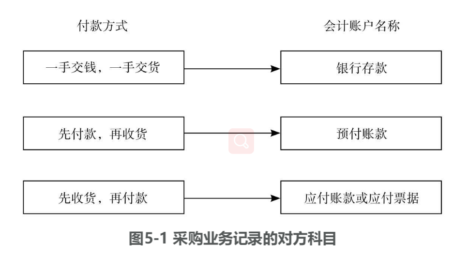
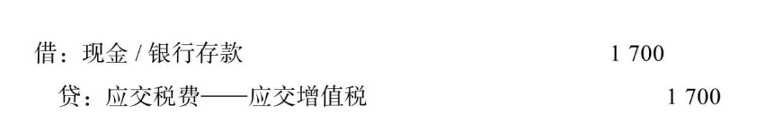
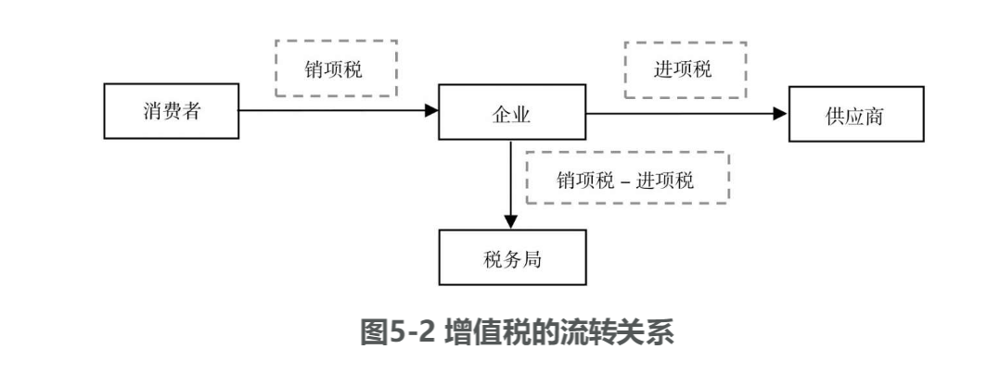

# 第3篇 洞察产业链条，挖掘采购潜力

# 5 买的没有卖的精 “欺软怕硬”的供应商

企业所有的业务都可以被简化成一个从现金到现金的周而复始的循环，采购业务是这个循环的前部分，本章我们将着重讨论采购业务及其财务表现，以及如何透过采购业务来了解企业与供应商的关系。

## 5.1 采购业务及其财务表现

采购业务处于销售业务之前，企业通过采购业务购进所需的原材料，通过生产把它们变成商品，再通过销售实现盈利。我们对照上一章销售业务的逻辑来看企业的采购业务：一是采购业务具体是如何展开的，二是采购业务在财务上是如何表现的。

采购业务处于销售业务之前  企业通过采购业务购进所需的原材料 

5.1.1 无处不在的采购业务

一般来说，销售业务可以分为两类，2 B业务（与其他企业发生交易）和2 C业务（与消费者个人直接发生交易）。对于制造有形商品的企业而言（如制造业、餐饮业、建筑业、农业等行业），无论产品是卖给个人还是企业，都需要采购原材料。比如，汽车厂商要买钢板来生产汽车，钢铁企业要买铁矿石来炼钢，手机公司要买芯片组装成手机，服装公司要买布料来生产服装。有的企业买的是原材料，比如钢铁企业购买的铁矿石，也有的企业买的是零部件或者加工过的原材料，比如手机公司买的芯片就是从其他芯片制造企业采购过来的。

原材料 

除制造业以外，其他所有制造有形商品的企业都需要去采购我们称为原材料的这一类东西。比如，饭店提供餐饮服务需要采购各种食材；建筑公司建房子，虽然不算制造业，但也需要购买建筑材料。甚至包括农业企业，比如种树的企业要买树苗、化肥、农药等。所以，所有制造有形商品的行业都需要采购原材料。实际上，制造无形商品的行业也需要采购原材料。

开发软件，制造游戏或者音频、视频节目的企业，或者提供服务的企业，比如美容院、航空公司、旅行社等，也会购买原材料。美容院需要买护肤品，航空公司需要给旅客提供餐食，旅行社可能也要为顾客提供饮用水等。所以，采购业务在各行各业中或多或少都会存在，只不过在制造业或者制造有形商品的行业中，采购量比较大，在制造无形商品的行业中，采购量比较小。

采购量比较小

5.1.2 采购业务的财务表现

采购业务在财务上会如何表现呢？我们主要谈三个问题：首先，发生采购业务时，在财务上记什么？其次，什么时候记？最后，怎么记以及记多少？

1．记什么

首先一定要记原材料。会计上，我们把原材料称作存货这个会计科目的子科目，存货除了包含原材料，还包含在产品、产成品等，我们会在之后的章节中介绍。所有会计的记录都有一个特点，就是企业发生任何交易行为，都要在两个或两个以上的会计科目中反映。因为当同一项业务发生时，至少会有两个会计项目受到影响（关于复式记账法的详细介绍，可参见9.3复式记账法）。比如，采购原材料，当然首先要记录相应的存货——原材料，但除此之外一定还有其他的项目会发生变化。如果采购是一手交钱，一手交货，那么企业手里的钱必然减少了，应同时记录现金或银行存款的减少。如果采购是先拿货，再付款，那么企业就产生了一项未来需要给供应商付款的义务，我们称之为应付账款。正因为这是一项要给他人付款的责任或者义务，所以它属于负债类的会计项目。在这种情况下，我们除了要记存货——原材料之外，还需要记录应付账款。

借：存货——原材料贷：现金/银行存款/应付账款/应付票据

在销售业务中，如果销售方先发货，再收款，那么其对手方——采购方就是先拿货，再付款。这种销售模式下，销售方记的是应收账款，采购方记的就是应付账款。销售方的应收账款还有一种特殊的形式——应收票据，指的是采购方给销售方开了一个票据，对于采购方来说，就是应付票据。这个票据可以是采购方自己承诺支付的——商业承兑汇票，也可以是采购方的银行承诺支付的——银行承兑汇票。

还有的时候，企业会采用先付款再收货的方式，或者先付一部分货款，后续再支付剩下的货款。如果企业在收货之前就支付了一部分或者全部的货款，就产生了一个向销售方收取货物的权利，这个权利属于资产，叫作预付账款。预付账款是指对方欠我们的货，所以是我们的资产。

付款时记录：借：预付账款贷：现金/银行存款收货时再记录：借：存货——原材料贷：预付账款采购业务记录的对方科目如图5-1所示。

2．什么时候记

采购货物的企业通常在收货时进行会计记录。需要说明的是，销售方是在发货时记录收入，而采购方需要等到收货时才记购进的存货，中间往往会有一个时间差。

3．怎么记以及记多少

采购业务记录中最复杂的问题就是记多少。存货的价值包含的内容较多：首先是商品的价格，除此之外，在采购过程中支付的运费、装卸费、保险费等也应包含在内，不论是制造业购买原材料，商业企业购买可供销售的库存商品，还是农业企业购买树苗、化肥、农药等。比较复杂的是税金的问题，即我们所说的增值税。

比如购买电脑，我们会在发票上看到两个价格：电脑商品的标价10000元，增值税1700元（假设增值税税率为17%），那么购买电脑的最终价格将是11700元。由此可以看出，增值税是由消费者来承担的成本。

因此：材料采购成本=商品价格+运费+装卸费+保险费+税金

在之前的销售环节中，我们记录的销售收入是不含税的收入，因为增值税由消费者来承担，销售方（即卖方）不应该计入自己的收入。但作为采购方，支付的增值税却是它成本的一部分，理应计入成本。

增值税看起来似乎并不复杂。不过你若细心观察就会发现，增值税明明由消费者承担，却由企业在缴纳。比如我们去超市买生活用品，从来没有去税务局交过增值税，其实我们是将税金交给了卖商品的企业，而企业替税务局收取了相应的增值税。比如我们花了11700元买电脑，卖电脑的企业替税务局收了1700元的增值税，这个税款并不是它的收入，它只是替税务局收款，因此有义务将这个税款交还给税务局。那么，企业应该如何记录这项增值税呢？

卖电脑的企业收取了1700元增值税，它有义务在规定的期限内上交税务局，这是它欠税务局的款项，属于企业的负债。这个负债称为应交税费，增值税只是企业应交税费中的一项，该明细项为应交增值税，除此之外，还有其他的应交税。

这里又产生了另一个复杂的问题：由于任何的采购事项都由购买方负担增值税，那么企业购进的原材料已经交过了税，当它把原材料加工成商品卖给客户，客户又通过企业再交了一部分税款。企业需要交给税务局的税款究竟是多少呢？已经交给上游供应商企业的那部分增值税，我们称为进项税。在销售的时候从客户收取的这部分增值税，我们称为销项税。企业应缴纳的税款，应该是从客户收取的增值税减去已经交给供应商的增值税，即销项税与进项税的差额（见图5-2）。

我们可以发现增值税的原始意图是，商品增值过程的每个环节，都只需要缴纳自己增值部分的税款，即销售价格与原材料价格差额部分的增值税。但现实中，我们购买商品时并不总能取得可供抵扣的增值税发票，比如企业在采购操作过程中因为各种原因，取得的发票达不到应该抵扣的金额要求；比如建筑企业向个人采购砂石，而砂石的销售方大多都是小规模的个体工商户，个人无法开具增值税发票；比如饭店采购蔬菜，服装企业采购花边、纽扣、针线等辅料，个人或者个体工商户也无法提供增值税发票。没有发票，采购的增值税就无法作为进项税来抵扣。所以在增值税上，现实情况的复杂会无意中提高企业在经营过程中的税收成本。

企业应缴纳增值税=销项税-进项税

